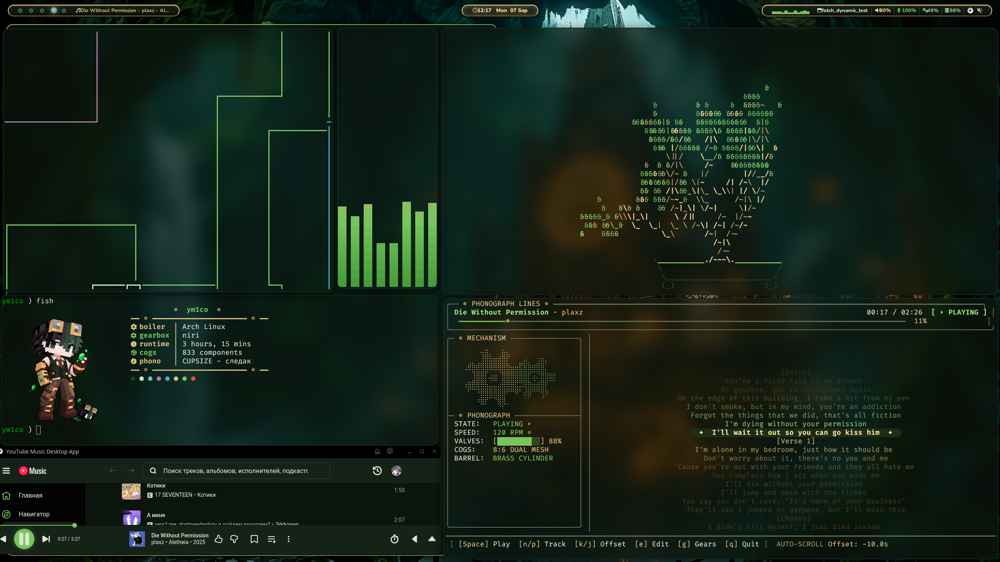
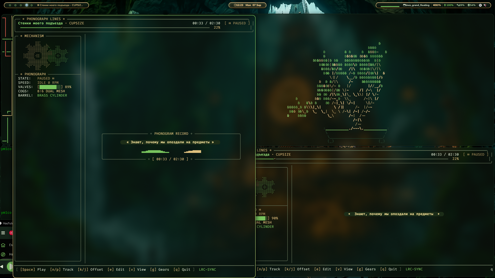

# ⚙️ Clockwork Sanctuary — Steampunk Niri Rice

<div align="center">


<p align="center">
  <b>A handcrafted, high-performance Steampunk Wayland desktop environment powered by Niri, featuring synchronized clockwork aesthetics, dynamic live lyrics phonograph, and custom workflow tooling.</b>
</p>



</div>

---

## 🌿 Palette & Atmosphere

- **Emerald Core**: `#78c45d` — Ancient overgrown moss and radiant jade crystals.
- **Antique Gold / Brass**: `#dec07e` — Precision watchmaker cogs, brass steam pipes, and vintage engravings.
- **Deep Obsidian Background**: `#080f0a` / `#0c140e` — Atmospheric velvet night shadows.
- **Steampunk Accents**: `#98bb6c`, `#e5c07b`, `#5c6370`.

---

## ❖ Showcase & Custom Utilities

### 1. `lines` — Grand Steampunk Phonograph Lyrics Player
An exclusive CLI lyrics visualizer designed from scratch with rich terminal graphics:
- **Braille Clockwork Mechanism**: Dual interlocking mechanical gears spinning in real-time according to track BPM and playback state.
- **Grand Plaque & Acoustic Waveform**: Live 20 FPS procedural acoustic frequency wave that pulses to the music rhythm.
- **Smart LRCLIB Sync**: Automatic artist and title normalizer with fuzzy matching and synchronized lyric highlighting.
- **View Modes**: Single line focus mode `[v]` or complete verse stream.

<div align="center">
  
</div>

### 2. `boiler` / `steam-gauge` — Imperial Steam Engine & Telemetry Plant
Translates live Linux hardware sensors (CPU, RAM, GPU, Disk, Temps) into a functioning Victorian steam plant:
- **Firebox Temperature & Manometer**: CPU Core temperature and load rendered as boiler steam pressure (`[ 3.4 BAR / 49.3 PSI ]`) with active safety valves.
- **Hydraulic Water Reservoir**: System RAM represented as a mechanical H₂O tank (`[ H₂O TANK: 20GB / 32GB ]`).
- **Dynamo & Flywheel**: GPU compute load mapped to a heavy brass dynamo with rotational flywheel RPM and wattage.
- **Oscillating Steam Pistons**: Real-time animated ASCII dual-cylinder pistons operating in counter-phase.
- **Interactive Gauges**: `[Space]` sounds the Imperial Steam Whistle (`💨 *TOOT TOOT*`), `[b]` engages the emergency blow-off valve, and `[c]` shovels coal into the firebox.

### 3. `fetch` / `fastfetch-live` — Dynamic Real-Time Fetch
- Replaces static fetch with a live, continuous updating dashboard.
- Displays media metadata (`phono`), system uptime (`runtime`), package count (`cogs`), compositor (`gearbox`), and kernel (`boiler`).
- Built-in hotkeys: `[Space]` Play/Pause, `[n]` Next track, `[p]` Previous track, `[q]` Exit.

### 4. `fix-audio` — PipeWire / WirePlumber Recovery
- Instant diagnostic and recovery tool for Wayland/PipeWire audio.
- Automatically detects and re-assigns USB composite audio sinks/sources when devices drop or fail.

### 5. `set-wallpaper` & `swaybg-wrapper`
- Curated 5K Steampunk art: *Clockwork Sanctuary* and *Ancient Clockwork Forest*.

### 6. Suite of Custom Tools
- **`roblox-antiafk`**: Background non-intrusive anti-AFK agent using direct XSendEvent (never steals focus or workspace).
- **`focus-mode`**: Anti-distraction / deep-work blocker for focus sessions.
- **`set-rgb-theme`**: Synchronizes hardware RGB peripherals (via OpenRGB) to match Emerald & Gold.
- **`davinci-*`**: Transcoder, cache cleaner (`davinci-clean`), and studio watcher for DaVinci Resolve.

---

## 🗂 Desktop Architecture

| Component | Technology | Description |
| :--- | :--- | :--- |
| **Window Manager** | [`niri`](https://github.com/YaLTeR/niri) | Infinite-ribbon scrollable tiling Wayland compositor |
| **Status Bar** | `waybar` | Steampunk themed bar with live MPRIS, CPU, MEM & clockwork icons |
| **Terminal** | `kitty` | Custom font rendering, dank tabs & emerald colorway |
| **Shell** | `fish` | Autocomplete, custom prompt & instant environment configuration |
| **Launcher** | `rofi-wayland` | Glassmorphic brass app launcher and system power menu |
| **Visualizer** | `cava` | Audio spectrum bar visualizer matched to emerald palette |
| **Notifications** | `mako` | Lightweight Wayland notification daemon with gold framing |
| **Screenshots** | `grim` + `slurp` | Bound to `Print` and `Super+Shift+S` |
| **Replay Buffer** | `gpu-screen-recorder` | 30-second rolling instant replay bound to `Alt+F10` |
| **Themes** | Custom CSS | YouTube Music Desktop App & Vesktop (Discord) matching themes |

---

## ⌨️ Keybindings Quick Reference

| Combination | Action |
| :--- | :--- |
| `Mod + Enter` | Open Kitty Terminal |
| `Mod + D` | Open Rofi Application Launcher |
| `Mod + L` | Open Steampunk Power Menu |
| `Mod + N` | Launch Nautilus File Manager |
| `Mod + M` | Launch YouTube Music |
| `Mod + Y` | Open `lines` Grand Phonograph Lyrics Player |
| `Mod + B` | Open `boiler` Imperial Steam Telemetry Dashboard |
| `Mod + O` | Launch Obsidian Knowledge Vault |
| `Mod + Shift + S` | Interactive Area Screenshot (saved to `~/Pictures/Screenshots`) |
| `Print` | Fullscreen Screenshot |
| `Alt + F10` | Save 30-second instant replay video |
| `Page Up` / `Page Down` | Toggle Master Audio Mute / Microphone Mute |
| `Mod + Left / Right` | Focus adjacent columns |
| `Mod + Wheel` | Scroll ribbon columns smoothly |

*(Note: `Mod` is mapped to the `Super` / Windows key)*

---

## 🚀 Installation & Deployment

### 1. Prerequisites (Arch Linux)

Install core packages:
```bash
sudo pacman -S --needed \
    niri waybar kitty fish rofi-wayland mako \
    pipewire pipewire-pulse wireplumber playerctl \
    grim slurp wl-clipboard swaybg cava fastfetch
```

*(Optional AUR tools: `gpu-screen-recorder`, `openrgb-bin`, `cbonsai-git`, `pipes.sh`)*

### 2. Clone and Install

```bash
git clone https://github.com/surf1k/dotfiles.git ~/dotfiles
cd ~/dotfiles
chmod +x install.sh
./install.sh
```

The installer will safely backup any existing configurations and symlink all files to `~/.config` and `~/.local/bin`.

---

<div align="center">
  <sub>Crafted with brass, steam, and electricity by <b>surf1k</b>.</sub>
</div>
